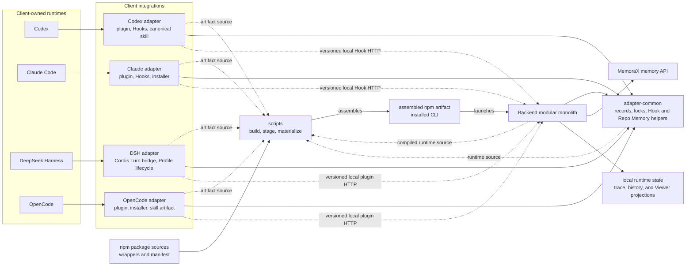
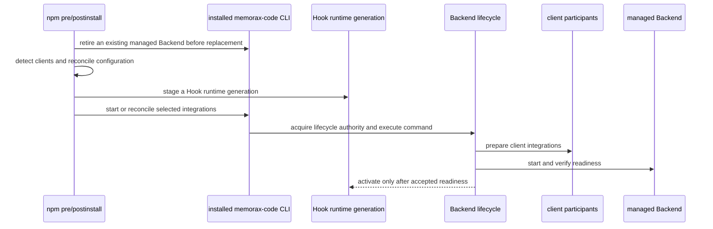
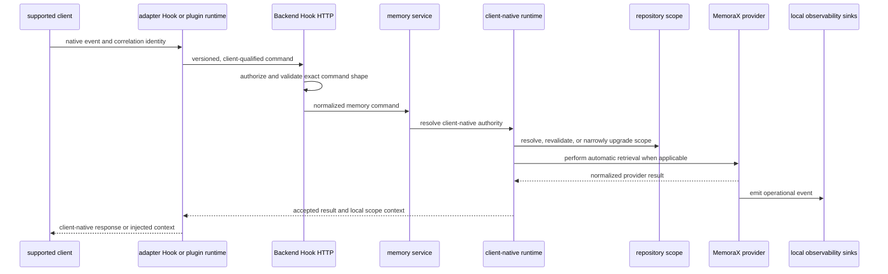
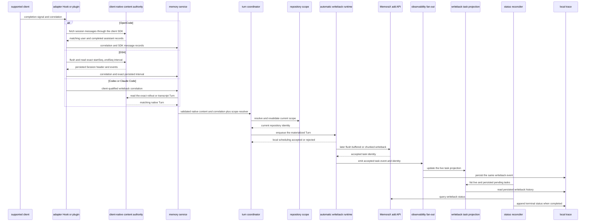
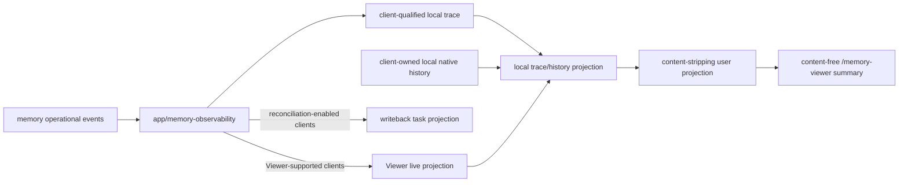
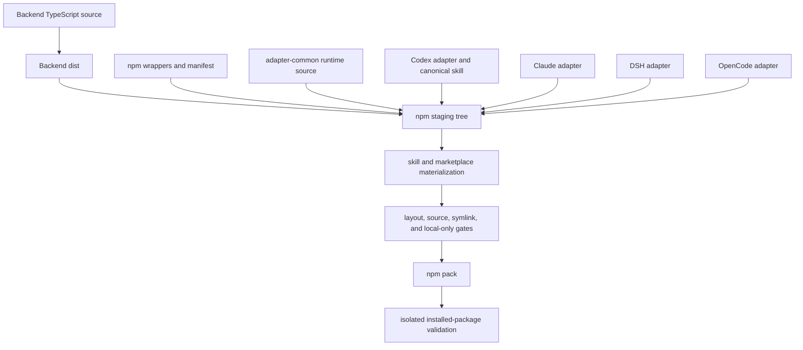

# MemoraX Code Architecture

This document describes the stable structure, process boundaries, authority
model, runtime flows, and code-placement rules of MemoraX Code. It is a map of
the current system, not a roadmap or a complete file inventory.

## 1. Purpose and Sources of Truth

- Live source, manifests, and executable tests are the authority for current
  behavior. This document explains their architectural intent.
- [AGENTS.md](AGENTS.md) defines working rules for coding agents, runtime and
  data invariants, verification commands, and Git handoff requirements.
- [CONTRIBUTING.md](CONTRIBUTING.md) defines the contributor workflow.
- [SECURITY.md](SECURITY.md) defines security and trust-boundary policy.
- [Configuration](docs/configuration.md) and
  [Troubleshooting](docs/troubleshooting.md) own detailed user-facing setup and
  diagnosis.

Architecture documentation should remain stable across ordinary refactors.
Do not copy volatile values such as package versions, ports, Hook ABI numbers,
timeouts, retry counts, batch sizes, endpoints, current test counts, or
artifact allowlists into this file. Their source or manifest remains
authoritative.

## 2. System Shape and Package Ownership

MemoraX Code integrates Codex, Claude Code, DeepSeek Harness (DSH), and
OpenCode with one local Backend. The Backend is a capability-oriented modular
monolith. The clients retain ownership of models, model-provider credentials,
native tools, model-provider traffic, and native transcript or message
creation.

Around the Backend are:

- four client deployment adapters;
- one lower-level shared runtime source layer;
- one npm assembly and installed-CLI layer; and
- repository automation that builds, validates, stages, and tests artifacts.



The diagram mixes packaging, source dependency, and runtime-call
relationships; the arrow labels distinguish them. It is not an import graph.

### 2.1 Repository components

| Component | Stable responsibility | Must not own | Primary evidence |
| --- | --- | --- | --- |
| `packages/ts/memorax-code-backend` | Local service, Hook HTTP, native client-content interpretation, memory workflows, repository scope, MemoraX adapter, trace, local Viewer with a content-free public HTTP surface, writeback reconciliation, and lifecycle | Model execution, client model-provider credentials, or native transcript creation | `packages/ts/memorax-code-backend/src/app/backend-server.ts`, `packages/ts/memorax-code-backend/src/memory/service.ts`, and the capability directories under `src` |
| `packages/ts/memorax-code-adapter-common` | Shared source for Backend connection authority, private runtime records, cross-process locking and configuration, Hook generations, Hook launch helpers, and Repo/Personal Memory helpers | Backend composition, native transcript interpretation, MemoraX request execution, or client plugin policy | `packages/ts/memorax-code-adapter-common/src/backend-connection.mjs`, `src/runtime-record.mjs`, `src/hooks`, and `src/repo-memory` |
| `packages/ts/memorax-code-codex-adapter` | Codex plugin artifact, Hook shells and runtimes, session/workspace observation, diagnostics, and the canonical shared skill | Codex rollout semantics or Backend-side writeback authority | `.codex-plugin`, `hooks`, `runtime-hooks`, `src`, and `skills/memorax-code` |
| `packages/ts/memorax-code-claude-adapter` | Claude Code plugin artifact, Hook shells and runtimes, configuration, installer, marketplace source, and diagnostics | Claude transcript semantics or Backend memory orchestration | `.claude-plugin`, `hooks`, `runtime-hooks`, `scripts`, and `src/plugin-install.mjs` |
| `packages/ts/memorax-code-dsh-adapter` | DSH Cordis Turn listener, personal-context composition, shared-skill and supervised Repo Memory integration, exact persisted-event interval validation, local Backend wire protocol, Profile lifecycle, per-user runtime-bundle materialization, and durable runtime authority | Backend-side event interpretation, MemoraX request execution, or DSH provider and session ownership | `src/plugin.mjs`, `src/profile-lifecycle.mjs`, `hooks/repo-memory-job.mjs`, and the adapter tests |
| `packages/ts/memorax-code-opencode-adapter` | OpenCode plugin runtime, managed thin-loader installation, automatic retrieval, SDK-backed writeback, shell-session identity, workspace runtime evidence and diagnostics, a materialized shared skill, and supervised Repo Memory maintenance and missing-bundle initialization | OpenCode message interpretation inside the Backend or model-provider configuration | `src/plugin.mjs`, `src/plugin-install.mjs`, `src/cli.mjs`, `src/repo-memory-server-runner.mjs`, and the OpenCode materialization mapping in `scripts/npm-source-files.mjs` |
| `packages/npm/memorax-code` | Installed executable wrappers, update, preinstall/postinstall, npm manifest, and release-package source | Backend lifecycle semantics, uninstall orchestration, or artifact staging | `bin`, `lib/run-entrypoint.mjs`, and `package.json` |
| `scripts` | Backend build orchestration, staging/materialization, package layout, documentation, and local-only data gates | Product runtime authority | Package-build/check scripts and executable contract scripts |
| `.github` | Issue and pull-request contribution templates | Product runtime behavior | `.github/ISSUE_TEMPLATE` and `.github/pull_request_template.md` |

`memorax-code-adapter-common` is a source layer consumed by the Backend and all
four adapters; it is not an independently deployed service. The npm artifact
assembles all runtime trees, but package assembly does not make the npm wrapper
the owner of their behavior.

### 2.2 Physical dependency directions

- The Backend and the Codex, Claude Code, DSH, and OpenCode deployment adapters
  may import adapter-common. Adapter-common must not import those higher-level
  components back.
- Adapter Hook and plugin runtimes do not import Backend implementation. They
  communicate through versioned, client-qualified local HTTP commands.
- Backend lifecycle may load adapter configuration or installers through
  lifecycle participants. Request-time memory processing must not depend on
  plugin installation or install-watchdog behavior.
- The npm layer locates staged entrypoints. `scripts` owns how source is
  materialized into that staged layout.
- The canonical user-facing `memorax-code` skill lives in the Codex adapter.
  Packaging materializes the Claude Code, DSH, and OpenCode artifacts from that
  source; do not maintain independent skill copies.

Client integration is deliberately not physically symmetric. Codex plugin
material belongs to the Codex adapter, while current install, activation, and
Hook-trust glue lives in Backend `clients/codex`. The Claude Code installer
lives in the Claude adapter. The DSH adapter owns Profile discovery and
mutation plus per-user runtime generation materialization. The OpenCode adapter
installs an auto-discovered thin loader and shared skill without editing
OpenCode provider configuration. These implementations are loaded by their
Backend lifecycle participants. Preserve the participant contract and each
client's actual authority instead of forcing matching directory shapes.

## 3. Runtime Flows

The system has two related but distinct planes. The control plane installs and
manages integrations and processes. The runtime data plane handles memory
operations for live client sessions.

### 3.1 Installation and lifecycle control plane



The principal control-plane locations are:

- `packages/npm/memorax-code/bin` for installed package scripts and wrappers;
- `packages/ts/memorax-code-backend/src/entrypoints/backend-cli.ts` for
  process-facing command orchestration;
- `packages/ts/memorax-code-backend/src/lifecycle` for start, stop, restart,
  status, uninstall, client selection, participants, and locks;
- `packages/ts/memorax-code-backend/src/lifecycle/backend` for Backend process,
  PID/token/connection records, cleanup, status probing, and shutdown;
- `packages/ts/memorax-code-adapter-common/src/hooks` for immutable Hook
  generation and launch selection; and
- each adapter lifecycle participant for client-specific preparation, status,
  disablement, and removal. OpenCode's participant delegates plugin and skill
  materialization to `memorax-code-opencode-adapter/src/plugin-install.mjs`;
  DSH's participant delegates Profile and runtime-bundle lifecycle to
  `memorax-code-dsh-adapter/src/profile-lifecycle.mjs`.

Staging and activation are separate decisions. A failed Backend start must not
replace the currently authoritative Hook generation. Cross-process lifecycle
decisions use durable records and bounded locks rather than relying on one
process's in-memory serialization.

DSH lifecycle discovery reads valid Profiles under `DSH_HOME`. The globally
staged adapter source is immutable; the adapter materializes a content-addressed
runtime generation under the selected `MEMORAX_CODE_HOME` and asks DSH's native
plugin command to install that generation into each managed Profile. The
Backend lifecycle lock is acquired before the DSH state lock. Start quiesces
the old authority, prepares Profile artifacts with authority disabled, and
activates them only after Backend readiness. Stop, update, and uninstall
publish disabled authority before Profile mutation. A disabled or invalid
runtime stays inert inside DSH rather than registering listeners or recovering
the Backend.

OpenCode lifecycle discovery accepts either its configuration directory or an
`opencode` executable on `PATH`, so Desktop-only, CLI-only, and combined
installations are supported. The installer records managed ownership under
`$MEMORAX_CODE_HOME/adapters/opencode`, writes the auto-discovered plugin and
skill artifacts under the OpenCode configuration directory, and leaves model
and provider configuration untouched.

When that managed plugin is enabled, plugin initialization starts one
best-effort Backend availability check without blocking OpenCode startup. The
first prompt shares one bounded interaction budget with that check; expiry
skips automatic memory handling for the current turn while Backend recovery
continues in the background. Idle writeback for an already accepted turn may
wait for the full in-process check. Recovery uses the package-recorded Node
runtime and `memorax-code start` entrypoint, exact MemoraX Code home and
OpenCode configuration directory, and the existing lifecycle lock. It does
not replace persistent client selection, directly spawn the Backend, or
recover a remote or invalid connection authority.

The enabled OpenCode plugin records content-free workspace runtime evidence on
plugin load and real user messages under its adapter state directory. The
OpenCode doctor combines managed-artifact status, that local evidence, and a
live Backend health check. This evidence proves only that the plugin executed
in a workspace; it is not session, transcript, repository-scope, or lifecycle
authority.

### 3.2 Hook and retrieval data flow



Important distinctions:

- Hook or plugin event fields supply protocol, correlation, and retrieval
  input. Their prompt or event text is not automatic writeback content
  authority; OpenCode's separately supplied SDK records are validated as
  client-native content.
- Codex rollout JSONL, Claude Code transcript JSONL, DSH's exact persisted
  Session Event Log interval, and OpenCode SDK session message records are the
  content authorities for their respective clients.
- Required client/session/turn identity and repository scope fail closed when
  incomplete, conflicting, or unprovable.
- A malformed or incomplete direct `.git` directory is the sole documented
  folder-scope fallback. That degraded scope may upgrade in-session only to a
  verified Git scope with the same Base User ID and canonical workspace root;
  all other scope changes remain mismatches.
- Local mode may authorize loopback requests without a configured token. Token
  authentication is required when configuration or exposure mode demands it.
- Client-specific runtimes interpret native formats. Client-neutral memory
  coordination does not parse, mix, or guess those formats.
- OpenCode's awaited `chat.message` plugin event supplies the correlated user
  prompt and injects accepted retrieval plus shared Skill reminder, User
  Profile, and Procedure Memory context into that message's system context. Its
  stable `session.compacted` event marks a durable supplemental reminder for
  the next real user message; synthetic and compaction messages do not consume
  that pending state. Local reminder evaluation remains independent of Backend
  recovery. Its `shell.env` event binds the native session identity and makes
  the packaged memory CLI available to agent-run shell commands.

### 3.3 Manual memory CLI flow

`memorax-cli` enters through Backend `src/memorax-cli.ts` and
`src/memory/cli.ts`. It does not traverse Hook HTTP or the `MemoryService`
composition, but it reuses the repository-scope, MemoraX-provider, and
local-trace components. Manual Add additionally validates user-supplied
`--reason` metadata. The direct entrypoint is not permission to fall back to
unscoped provider calls or to reconstruct identity from unrelated process
state.

After a degraded direct `.git` directory is repaired, each CLI operation
resolves the verified Git scope immediately; no client-session restart is
required.

### 3.4 Automatic writeback and reconciliation

Writeback is a separate branch, not the tail of every memory operation.



- Retrieval events do not enter reconciliation.
- Local enqueue acceptance is the metadata-consumption point; provider I/O may
  occur later through the automatic writeback runtime.
- Buffering and chunking belong to the memory capability; rollout, transcript,
  DSH event-interval, and SDK message parsing remains client-specific.
- DSH accepts only a contiguous native interval bounded by the matching
  `turn/start` and completed `turn/end`. The Backend materializes direct user
  text and visible model-assistant text; plugin recall, tools, reasoning, and
  incomplete Turns are excluded. Only non-delegated sessions are eligible.
- A valid persisted DSH interval can restore automatic writeback after a
  Backend restart without cached Turn metadata; repository scope is still
  resolved and validated from the persisted Session workspace.
- DSH uses the shared retrieval, buffering, chunking, redaction, provider, and
  client-qualified trace paths. Its normalized Search and Add operations enter
  DSH trace and pending Add tasks use the shared writeback-reconciliation
  projection. Its Viewer projection remains intentionally disabled until that
  capability is added explicitly.
- OpenCode terminal handling accepts only matching SDK user and completed
  assistant records for the correlated session and parent message. An exact
  `MessageAbortedError` closes the Turn as interrupted without writeback; other
  errors, summary, compaction, incomplete, or identity-mismatched messages are
  rejected. It does not fall back to plugin prompt text or local database
  guesses.
- Because OpenCode terminal notifications are event callbacks, the plugin
  serializes idle- and interruption-triggered SDK reads per session, tracks
  the resulting work, and drains already-started tasks during plugin disposal.
- When a degraded direct-`.git` scope upgrades to verified Git scope, the
  buffer runtime cancels and discards pending fallback turns for the same
  client and session before buffering under the Git scope. It does not migrate
  or flush those turns across namespaces.
- Pending writeback status can be reconstructed from client-qualified local
  trace after Backend restart. A still-pending provider status updates
  in-memory reconciliation policy rather than appending a new trace event.

### 3.5 Repo Memory coordination

Repo Memory is repository-local guidance under `.repo_memory`, not a MemoraX
provider response. In all four clients, an accepted turn-start result exposes
a worktree to the maintenance-aware adapter integration only for a verified
Git scope; the Viewer separately projects Repo Memory readiness. Codex and
Claude Code Hooks, DSH's native pre-step integration, and OpenCode's awaited
`chat.message` handler may schedule a missing bundle build using adapter-common
supervision, locking, and job-policy helpers. They must use the Backend-resolved
worktree rather than adapter-local workspace input.

Codex and OpenCode keep the generic shared Skill reminder available when the
Backend or repository scope is unavailable. Codex, DSH, and OpenCode enable
their User Profile and Procedure Memory builders only when the current
turn-start result includes a Backend-resolved worktree, and those builders read
that worktree. The original client workspace remains metadata when an accepted
turn's reminder is traced; it is not repository-local content authority.

A relevant repo-read can invoke supervised maintenance in all four clients.
The runner validates the bundle and selects a background build, update, or
no-op according to policy. DSH maintenance runs through an enabled, managed
headless-capable Profile. For OpenCode, both on-demand maintenance and
first-eligible-prompt initialization run through a short-lived subagent session
on the active OpenCode server; Desktop-only installations do not require a
standalone OpenCode CLI.

## 4. Backend Modular Monolith

The Backend is organized by capability, with lightweight capability-local
layering. Its top-level directories are not a strict linear dependency chain.

### 4.1 Composition roots and stable facades

| Location | Architectural role | Must remain free of |
| --- | --- | --- |
| `src/entrypoints/backend-cli.ts` | Process and management-CLI composition; dispatches lifecycle, client integration, and raw server commands | Memory business rules |
| `src/app/backend-server.ts` | Runtime HTTP composition root; creates routes, memory service, observability, background reconciliation, and shutdown resources | Installation and plugin lifecycle |
| `src/memory/service.ts` | Secondary composition point inside the memory capability; assembles client runtimes, turn coordination, repository sessions, and automatic memory workflows | Node HTTP and process entrypoint concerns |
| `src/server.ts` | Stable executable/import facade for the Backend server | Application composition logic beyond delegating to owning modules |

### 4.2 Source layout

```text
src/
  app/                    runtime composition, state, observability
  clients/
    codex/                Codex native interpretation and lifecycle adapters
    claude/               Claude native interpretation and lifecycle participant
    dsh/                  DSH native event-interval interpretation
    opencode/             OpenCode retrieval, SDK message interpretation, and lifecycle participant
  config/                 Backend and proxy/config interpretation
  entrypoints/            process and management-CLI orchestration
  lifecycle/
    backend/              managed Backend process and durable lifecycle records
  memory/                 client-neutral memory workflows and coordination
  provider/
    memorax/              MemoraX configuration, payloads, transport, results
  repository/             repository identity and Repo Memory readiness
  shared/                 narrow Backend-local primitives without domain ownership
  trace/                  client-qualified local operational trace
  transport/
    http/                 shared Backend HTTP and Hook wire adaptation
  viewer/
    model.ts              shared public Viewer data contract
    store.ts              local event/history aggregation and orchestration
    history/              Claude native history and session-title derivation
    http/                 public Viewer routes
    projection/           read models and operational projections
    ui/                   static HTML and image assets
```

The source root also contains a small, tested set of stable compiled
entrypoints and compatibility facades. It is not another implementation area.

### 4.3 Capability ownership

| Path | Responsibility | Important boundary |
| --- | --- | --- |
| `src/entrypoints` | Direct-execution detection, CLI parsing, command dispatch, process signals, and process-facing orchestration | Does not own memory rules |
| `src/app` | Backend state/security, runtime resource assembly, observability fan-out, active requests, and graceful shutdown | Does not install plugins or own the lifecycle control plane |
| `src/transport/http` | Shared Backend HTTP authorization, request/JSON helpers, error mapping, health, and Hook wire adaptation | Viewer endpoints and outbound provider HTTP remain with their capabilities |
| `src/lifecycle` | Contracts, participants, client selection, locks, service orchestration, install watchdog, and client integration removal | Request-time memory flow does not depend on it |
| `src/lifecycle/backend` | Managed process, PID/token/connection records, status probing, cleanup, and shutdown requests | Helper contracts do not depend back on the full service implementation |
| `src/clients/codex` | Codex rollout, prompt, turn-index, and workspace interpretation; Hook memory runtime; plugin integration glue; and lifecycle participant | No Claude format fallback; request runtime remains HTTP-composition independent |
| `src/clients/claude` | Claude transcript/turn interpretation, Hook memory runtime, and lifecycle participant | No Codex format fallback; request runtime remains HTTP-composition independent |
| `src/clients/dsh` | DSH Session header and exact persisted event-interval interpretation, request-time memory and normalized trace runtime, and lifecycle-participant delegation | No Hook-text, rollout, transcript, SDK-message, or latest-Turn fallback; Profile mutation stays in the DSH adapter and request runtime remains HTTP-composition independent |
| `src/clients/opencode` | OpenCode SDK message validation and text materialization, plugin memory runtime, and lifecycle participant | No Hook-text, database, rollout, or transcript fallback; request runtime remains HTTP-composition independent |
| `src/memory` | Memory commands, retrieval, writeback, turn coordination, repository session pinning, manual CLI, buffering/chunking, task projection, and reconciliation | Client-neutral modules do not parse native transcript formats |
| `src/repository` | Read-only repository identity and Repo Memory readiness | Scope derivation does not execute Git or use synchronous filesystem reads |
| `src/provider/memorax` | MemoraX config interpretation, query/add/status payloads, HTTP transport, and normalized results | Independent from server routing and plugin lifecycle |
| `src/trace` | Client-qualified trace config/context/store, current-turn state, retention, and JSONL persistence | Trace core has no outbound-network authority |
| `src/viewer/model.ts` | Shared Viewer contract | Independent from Viewer Store, routes, and projections |
| `src/viewer/store.ts` | Local Viewer event/history aggregation and projection orchestration | Derived state is not memory, transcript, session, scope, or lifecycle authority |
| `src/viewer/history` | Claude native-history reading and shared session-title derivation | Pure history transformations use the model; explicit Store-facing adapters remain narrow |
| `src/viewer/projection` | Activity, history, user, redaction, writeback, cache, and observability projections | Pure read-model projections do not depend on the aggregate Store; observability is an explicit Store sink |
| `src/viewer/http` | Content-free public summary HTTP adapter | Reads local state; does not poll the MemoraX provider or run reconciliation |
| `src/viewer/ui` | Static Viewer HTML and image assets | No runtime authority |
| `src/config` | Backend, MemoraX Code, and proxy environment/config interpretation | Configuration parsing stays independent of route composition |
| `src/shared` | Narrow utilities such as JSONL append, record guards, debug logging, and Windows invocation | Not a dumping ground for business types or policy |

### 4.4 Stable Backend root surfaces

| Root module | Role |
| --- | --- |
| `memorax-code.ts` | Management CLI process entrypoint |
| `memorax-cli.ts` | Manual memory CLI process entrypoint |
| `service-entrypoint.ts` | Guarded managed-child-process entrypoint |
| `server.ts` | `memorax-code-backend` executable and stable `createBackendServer` export facade |
| `codex-adapter-lifecycle.ts` | Compatibility re-export of the Codex lifecycle participant |
| `jsonl-append.ts` | Compatibility re-export of the shared JSONL primitive |
| `windows-cli-invocation.ts` | Compatibility re-export of the shared Windows invocation primitive |

The exact root allowlist is enforced by the
[Backend source boundary test](packages/ts/memorax-code-backend/test/architecture/source-boundaries.test.mjs).
New implementation must go into a capability directory. Adding a root module
is a deliberate compatibility or packaging decision and requires the
architecture contract to change in the same patch.

## 5. Dependency Model and Executable Contracts

### 5.1 Why there is no top-level layer order

Some top-level directories have imports in both directions while the module
graph remains acyclic:

| Directory relationship | Why it exists |
| --- | --- |
| `app` and `transport` | The app composes routes; shared HTTP helpers consume the narrow `BackendState` contract |
| `app` and `lifecycle` | The server reads active-client state; managed-service helpers consume narrow app state/security functions |
| `clients` and `memory` | Memory service composes client runtimes; client runtimes consume client-neutral memory contracts |
| `clients` and `lifecycle` | Clients implement lifecycle participants; orchestration consumes those participants |
| `clients` and `trace` | Client runtimes record trace; trace Store/model code consumes client activity, token, and identity types |
| `memory` and `provider` | Memory invokes the provider; provider emits memory-owned observability contracts |
| `memory` and `repository` | Memory resolves scope; readiness uses the shared project identity contract |
| `memory` and `trace` | Memory carries trace context; trace context uses the memory project identity |

These are directory-level relationships, not source-module cycles. Do not draw
a fictional global `entrypoint -> application -> domain -> infrastructure`
rule over this repository. Move composition outward, define narrow ports in
the capability that owns their meaning, and keep the complete module graph
acyclic.

### 5.2 Important ports and contracts

| Contract | Owned by | Purpose |
| --- | --- | --- |
| `MemoryService` | `memory/service.ts` | HTTP-independent command surface for memory operations |
| `MemoryObservabilityHook` | `memory/observability.ts` | Emits normalized operational events without importing the concrete trace Store, Viewer sinks, or Backend logging |
| `MemoryDiagnosticLogger` | `memory/observability.ts` | Injects diagnostics without binding memory kernels to Backend debug output |
| `MemoryTurnCoordinator` | `memory/turn-coordinator.ts` | Correlates and validates client-neutral Turns and controls metadata consumption |
| `RepositoryMemorySessionRuntime` | `memory/repository-session.ts` | Pins and validates repository scope, including the bounded degraded-direct-`.git` to verified-Git upgrade |
| `AdapterLifecycleParticipant` | `lifecycle/participant.ts` | Lets lifecycle orchestration use client adapters without embedding their implementation details |
| Backend lifecycle contracts | `lifecycle/contracts.ts` | Separate `BackendServiceOptions`, injectable runtime, resolved endpoint, and `BackendServiceResult` from managed-service implementation |

Ports stay with the capability that owns their semantics. A contract used by
multiple directories does not automatically belong in `shared`.

### 5.3 Executable architecture contracts

| Contract | Location | Enforces | Inspect or update when |
| --- | --- | --- | --- |
| Backend source boundaries | `packages/ts/memorax-code-backend/test/architecture/source-boundaries.test.mjs` | Root facade allowlist, selected direct forbidden imports, public Viewer HTTP ownership, lifecycle delegation, and an acyclic relative-import graph | Adding a root surface, crossing capability boundaries, or changing a composition root |
| Local-only trace boundary | `scripts/check-local-trace-only.mjs` and its tests | Reviewed network-capable production modules, trace-core isolation, unreviewed trace-aware outbound bridges, and staged artifact/symlink containment | Moving or adding network code, trace-aware outbound code, or staged paths |
| Package shape | npm package tests and package-build/check scripts | Executable wrappers, staged runtime layout, canonical source mapping, compatibility paths, and artifact allowlists | Changing entrypoints, packaging sources, materialization, or layout |
| Documentation contract | `scripts/check-docs.mjs` and its tests | Relative links, personal absolute paths, and shipped-document consistency | Adding a root document or changing document/package layout |
| Platform-specific consumers | Repository scripts and platform harnesses | Explicit test paths, test-name patterns, and platform lifecycle scenarios | Moving, splitting, or renaming tests or platform entrypoints |

The forbidden-import rules are targeted direct-import checks for named
modules; they are not a universal directory-level or transitive dependency
checker. The acyclic check separately covers all Backend TypeScript relative
imports.

Do not weaken an executable boundary merely to make a new import or path pass.
If the intended architecture has not changed, move composition outward or
introduce a narrow port. If the boundary itself intentionally changes, update
this document and the executable contract together.

## 6. Authority, Trace, and Viewer Boundaries

The normative fail-closed, privacy, and publication rules remain in the AGENTS
guidance for
[Hook, session, and scope invariants](AGENTS.md#3-hook-session-and-scope-invariants)
and
[data and user-facing boundaries](AGENTS.md#4-data-and-user-facing-boundaries).

### 6.1 Authority map

| Concern | Authority | Derived or non-authoritative views |
| --- | --- | --- |
| Models, model-provider credentials, native tools, and model-provider traffic | Codex, Claude Code, DeepSeek Harness, or OpenCode | Backend and adapters must not proxy or persist this authority |
| Hook command identity | Versioned, client-qualified command plus validated required session/turn fields | Parsed HTTP request objects |
| Automatic writeback content | Codex rollout JSONL, Claude Code transcript JSONL, DSH's exact persisted Session Event Log interval, or OpenCode SDK session messages for the matching client and Turn | Hook or plugin text, trace, latest-Turn guesses, local database guesses, and another client's format are not fallbacks |
| Workspace and repository identity | Backend read-only resolution held by the live repository-session runtime; its only permitted scope transition is the same-root degraded-direct-`.git` to verified-Git upgrade | Project labels, Viewer catalog entries, and Hook `cwd` |
| Backend connection and managed-process ownership | Versioned private connection/token/PID records plus lifecycle lock/version validation | In-memory state in any one process |
| MemoraX memory result and asynchronous task state | Normalized response from `provider/memorax` | Observability, trace, Viewer, and task projections |
| Persisted current-turn operational state and trace history | Client-qualified local trace records | Viewer summaries and diagnostics; not native content or general Turn-identity authority |
| Repo Memory bundle | Repository-local `.repo_memory` files produced by the supervised job | Backend readiness and client-injected guidance |

The Viewer is never memory, transcript, session, repository-scope, or
lifecycle authority.

### 6.2 State classes and shutdown ownership

Ephemeral process state includes active HTTP requests, turn coordination,
repository-session bindings, in-flight provider operations, Viewer projection
caches, and background reconciliation promises.

Durable local state includes configuration, private runtime records, active
client selection, client-qualified trace JSONL, reminder cadence state, and Repo
Memory. State shared across processes requires a bounded lock, atomic
replacement, or version validation appropriate to its record. An in-memory
mutex is not cross-process authority.

Backend-owned remote memory state is limited to MemoraX memories and
asynchronous writeback tasks. The provider adapter is the network boundary for
documented memory payloads.

The runtime composition root owns bounded graceful shutdown. It starts closing
writeback reconcilers, closes HTTP intake, waits for active requests, and then
drains the memory service and observability within one deadline. It waits for
already-started background work before closing the memory service. Lifecycle
control requests shutdown rather than reaching into those resources and
closing them ad hoc.

### 6.3 Observability and local-only data flow



Memory kernels emit through injected observability and diagnostic ports. The
Backend composition root decides which local sinks are active. This keeps
provider and memory code independent from the concrete trace Store, Viewer,
and Backend debug logger.

Raw native transcript files, transcript paths, and retained trace files stay
local. Only normalized search, add, and add-status requests cross the MemoraX
provider boundary. An Add request may carry messages materialized from the
exact native Turn, but it does not upload the raw file or unrelated transcript
content. A production module that gains network capability must be explicitly
reviewed by the local-only gate; trace-core modules must remain network-free,
and a module must not combine trace storage with outbound authority without a
reviewed contract.

For DSH, Cordis `turn/start` establishes only live trace identity. After
`turn/end`, the adapter flushes persistence and supplies the exact native Turn
interval; only a Backend-validated interval may produce normalized
`turn_materialized` content and writeback trace events. The raw Session Event
Log and its path are never copied into trace.

`/memory-viewer` reads local trace/history/projection state. The local Store
and history readers may process content-bearing trace or native history only
to produce the safe public projection. The HTTP response never returns
conversation or memory text, session or turn identifiers, transcript paths,
or raw trace details. It never polls MemoraX. Pure read-model projections
depend on `viewer/model.ts` rather than the aggregate Store, and `viewer/http`
is constrained to the public route module.
DSH is intentionally absent until its safe projection contract is implemented;
DSH trace events fail closed at the current Viewer boundary.

## 7. Packaging and Distribution



- Backend TypeScript is compiled before staging; generated `dist` is not
  committed.
- Adapter-common and adapter `.mjs` runtime trees are staged from declared,
  tracked source.
- DSH lifecycle treats that staged source as read-only. It materializes a
  content-addressed generation under `$MEMORAX_CODE_HOME/adapters/dsh/runtime`
  and installs the generation into managed Profiles; the Profile artifact
  excludes lifecycle control-plane source.
- The Claude Code skill and marketplace and the OpenCode skill artifact are
  materialized from canonical sources; packaging may rewrite contained
  relative imports for the staged topology.
- OpenCode lifecycle installation writes only a managed thin loader and the
  materialized skill into the client's auto-discovery directories. It does not
  edit `opencode.json` or `opencode.jsonc`. Desktop discovery does not require
  a standalone `opencode` command in `PATH`; CLI-only discovery does.
- The npm wrappers use `packages/npm/memorax-code/lib/run-entrypoint.mjs` to
  locate staged Backend or adapter entrypoints, including each client-specific
  diagnostics CLI.
- Artifact gates reject undeclared paths, unsafe symlinks, cache/build debris,
  and local-only data-boundary violations.
- Installed-package tests isolate `MEMORAX_CODE_HOME`, `CODEX_HOME`,
  `CLAUDE_CONFIG_DIR`, `DSH_HOME`, and `OPENCODE_CONFIG_DIR` so lifecycle and
  client integration checks do not reuse developer state.

Root architecture and contributor guidance are repository documents, while
`shipped-docs.json` remains the authority for user documentation included in
the npm package.

## 8. Test Architecture and Change Routing

Backend tests mirror capability ownership. They do not mirror every source
file and are not divided first into unit and integration layers.

| Source responsibility | Primary Backend test area |
| --- | --- |
| `src/app` | `test/app` |
| `src/clients/<client>` | `test/clients/<client>` |
| `src/config` | `test/config`, with composition coverage in `test/app` and MemoraX configuration coverage in `test/provider/memorax` |
| `src/entrypoints` and root executable behavior | `test/entrypoints`; management-CLI lifecycle behavior in `test/lifecycle`; root allowlist in `test/architecture` |
| `src/lifecycle` and `src/lifecycle/backend` | `test/lifecycle` and `test/lifecycle/backend` |
| `src/memory` | `test/memory` |
| `src/provider/memorax` | `test/provider/memorax` |
| `src/repository` | `test/repository` |
| `src/shared` | `test/shared` |
| `src/trace` | `test/trace` |
| `src/transport/http` | `test/transport/http` |
| `src/viewer` | `test/viewer`, organized by history, HTTP, and projection behavior |

Placement rules:

- Cross-capability server composition belongs in `test/app`; wire-level Hook
  protocol behavior belongs in `test/transport/http`.
- Area-specific fixtures belong in `test/<area>/support`; only helpers truly
  shared across responsibilities belong in `test/support`.
- `test/architecture` has no source counterpart. It owns source topology,
  root-surface, public-route, delegation, and dependency-cycle contracts.
- Backend behavior tests build and exercise `dist`; architecture tests inspect
  `src` directly.
- The Backend suite discovers nested tests recursively. Codex, Claude Code,
  DSH, and OpenCode adapter suites currently discover only flat
  `test/*.test.mjs`; their package scripts must change before tests are nested.
- Adapter-common has no standalone suite. Its changes are verified through all
  affected consumers: Backend, all four adapters, and package checks when
  staged runtime layout is involved.
- Before moving, splitting, or renaming tests, search `scripts` and `.github`
  for explicit paths and test-name patterns.

Contributor-facing verification profiles are centralized in
[AGENTS.md Section 5](AGENTS.md#5-verification). Architecture change routing
uses those named profiles rather than copying commands here.

| Change surface | Primary evidence | Contracts to inspect | Verification profile |
| --- | --- | --- | --- |
| One Backend capability | Matching `test/<area>` | Source boundaries when imports change | Backend |
| Runtime composition | `test/app` | Backend source boundaries | Backend |
| Hook HTTP or adapter-visible command schema | `test/transport/http` and affected adapter suites | Backend source boundaries and package shape when staged | Backend + Adapter-common/shared Hook; add Install/artifacts when staged package shape changes |
| Backend root entrypoint or compatibility facade | Entrypoint, architecture, and npm package tests | Source boundaries and package shape | Backend + Install/artifacts |
| Client-native parsing or identity | `test/clients/<client>` | Source boundaries | Backend |
| Client adapter plugin or Hook deployment | Matching adapter suite and affected Backend contract tests | Package shape when staged | Codex, Claude Code, DSH, or OpenCode; add Adapter-common/shared Hook for shared Hook source and Install/artifacts for staged package shape |
| Adapter-common | Affected Backend tests and all four adapter suites | Package shape when staged layout changes | Adapter-common/shared Hook; add Install/artifacts when staged runtime or package layout changes |
| MemoraX provider, trace, or outbound transport | Matching Backend tests | Local-only trace boundary | Backend + Trace/local-only boundary |
| Test relocation | Moved owning suite | Platform-specific consumers | Matching named profile |
| Packaging/materialization | npm package tests and artifact gates | Package shape and local-only trace boundary | Install/artifacts |
| Cross-package architecture | All affected suites | Every affected executable contract | Broad cross-layer; add Install/artifacts when staging or layout changes |
| Documentation only | Documentation contract | Links and root/shipped-doc registration | Documentation |

## 9. Maintaining This Document

Update `ARCHITECTURE.md` in the same change when any of these move or change
meaningfully:

- package ownership or a physical package dependency;
- a composition root or process boundary;
- capability directory responsibility;
- a stable root entrypoint or compatibility facade;
- state, transcript, repository-scope, memory, trace, or Viewer authority;
- an intentional forbidden-dependency exception;
- the local-only data or packaging boundary; or
- test ownership and executable architecture contracts.

An implementation refactor within an existing documented capability does not
require an architecture update when ownership, authority, dependencies,
entrypoints, and test placement remain unchanged.

Do not record current file counts, line counts, commit IDs, pull requests,
temporary branches, or future split candidates here. Those are historical or
planning data, not architecture.

Related documents:

- [Agent working rules](AGENTS.md)
- [Contributor workflow](CONTRIBUTING.md)
- [Security policy](SECURITY.md)
- [Configuration](docs/configuration.md)
- [Troubleshooting](docs/troubleshooting.md)
